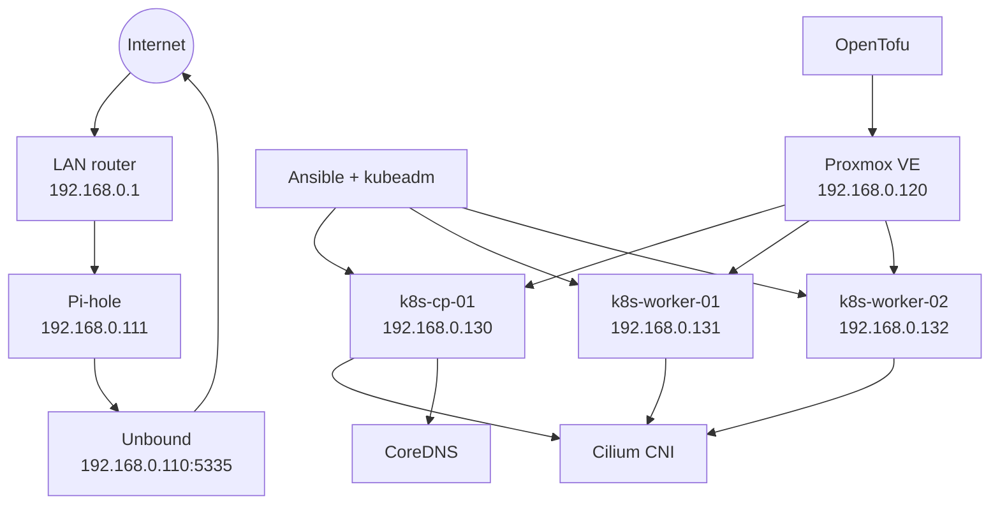

# Kubernetes Platform

## Scope and Status

This document describes the Kubernetes platform declared by this repository. It is an architecture and automation snapshot, not evidence that the cluster is currently provisioned or healthy. Confirm live state with the validation procedure before operating workloads.

The platform uses upstream Kubernetes on Proxmox VE virtual machines. OpenTofu provisions infrastructure, Ansible configures Linux and Kubernetes, kubeadm bootstraps the cluster, containerd runs containers, and Cilium provides pod networking.

## Architecture



The cluster is a single-control-plane design and is not highly available. The future three-control-plane topology and API load balancer described in [ADR-0002](../../adr/ADR-0002-kubernetes-platform-architecture.md) are not implemented by the current inventory or VM configuration.

## Infrastructure Architecture

The Proxmox host (`pve`, `192.168.0.120`) runs the Kubernetes VMs on bridge `vmbr0`, in the `kubernetes-pool`, using the `vmdata` datastore. The repository separates shared Proxmox foundations in `infrastructure/proxmox/` from Kubernetes VM lifecycle in `kubernetes/opentofu/`.

The current Kubernetes VM definitions use Debian Cloud-Init template ID `9000`, DHCP for IPv4, the `debian` account, and the local `~/.ssh/id_ed25519.pub` key. Each VM has 2 vCPUs and a 20 GiB disk; the control plane has 4096 MiB RAM and each worker has 2048 MiB. The VM names, MAC addresses, and desired roles are defined in `kubernetes/opentofu/terraform.tfvars.example`; treat that file as an example, not as proof of the values applied to Proxmox.

OpenTofu provisions VMs. Ansible configures the operating system and Kubernetes. Kubernetes manages workloads. These are separate ownership boundaries; do not manage the same VM lifecycle from both OpenTofu roots.

## Network Architecture

The documented LAN is `192.168.0.0/24`, with the router at `192.168.0.1`. The Kubernetes inventory expects these node addresses:

| Node | Role | Inventory address | vCPU | Memory | Disk |
| --- | --- | ---: | ---: | ---: | ---: |
| `k8s-cp-01` | Control plane | `192.168.0.130` | 2 | 4096 MiB | 20 GiB |
| `k8s-worker-01` | Worker | `192.168.0.131` | 2 | 2048 MiB | 20 GiB |
| `k8s-worker-02` | Worker | `192.168.0.132` | 2 | 2048 MiB | 20 GiB |

The VM configuration requests DHCP, while Ansible uses fixed inventory addresses. Ensure the DHCP server reserves the VM MAC addresses to these addresses, or update the inventory to match the addresses actually assigned, before running Ansible. The current VM configuration does not set the static addresses itself.

ADR-0002 declares pod CIDR `10.244.0.0/16`, service CIDR `10.96.0.0/16`, and API name `k8s-api.home.arpa`. These are architectural targets, not all wired into the current bootstrap: the `kubeadm init` task does not pass the pod network CIDR or a control-plane endpoint, and the inventory contains no API load balancer. The validation role expects the DNS service IP `10.96.0.10`.

## Node Inventory

The source of truth for Ansible targets is `ansible/inventories/lab/hosts.ini`:

| Group | Hosts | Purpose |
| --- | --- | --- |
| `raspberry` | `dns-01`, `node-01`, `node-02` | Edge Linux hosts |
| `unbound` | `dns-01` (`192.168.0.110`) | Recursive DNS resolver |
| `pihole` | `node-01` (`192.168.0.111`) | LAN DNS filtering/forwarding |
| `control_plane` | `k8s-cp-01` (`192.168.0.130`) | Kubernetes API and control-plane components |
| `workers` | `k8s-worker-01`, `k8s-worker-02` (`.131`, `.132`) | Kubernetes workloads |

The `kubernetes` group is the parent of `control_plane` and `workers`. The inventory uses SSH user `debian` for Kubernetes hosts. Verify address, SSH reachability, and credentials before provisioning or configuring nodes.

## Bootstrap and Ansible Automation

Run Ansible commands from the `ansible/` directory so `ansible.cfg` supplies the role path and inventory defaults. The automation sequence is:

1. `playbooks/bootstrap.yml` applies the Linux and Raspberry Pi baseline to the `raspberry` group.
2. `playbooks/kubernetes.yml` applies the Linux baseline and Kubernetes prerequisites to every Kubernetes node, initializes the control plane with kubeadm, joins workers, installs Cilium with Helm, then configures CoreDNS.
3. `playbooks/kubernetes-validation.yml` checks node services, cluster readiness, Cilium, and internal, edge, and external DNS.

The Kubernetes baseline loads kernel modules `overlay` and `br_netfilter`, enables IPv4 forwarding and bridge netfilter sysctls, installs required packages, and configures time synchronization. The runtime role configures containerd to use the systemd cgroup driver. The package role installs `kubeadm`, `kubelet`, and `kubectl` from the Kubernetes `v1.37` apt repository.

Control-plane initialization is guarded by `/etc/kubernetes/admin.conf`; worker joining is guarded by `/etc/kubernetes/kubelet.conf`. Worker join tokens are generated at execution time and hidden by Ansible logging. Do not copy join tokens or kubeconfig credentials into Git or issue comments.

## OpenTofu Automation

`infrastructure/proxmox/` is the shared Proxmox foundation root. `kubernetes/opentofu/` provisions the Kubernetes VMs using the `bpg/proxmox` provider and consumes the existing `kubernetes-pool`. The VM root requires a local variable file based on `terraform.tfvars.example`, a reachable Proxmox API, provider credentials, the configured VM template, storage, and SSH public key.

From the repository root, validate and plan the VM root with:

```sh
cd kubernetes/opentofu
tofu init
tofu fmt -check
tofu validate
tofu plan
```

Review the plan and confirm the target Proxmox node, template, pool, datastore, MAC addresses, and DHCP reservations before applying. Keep local variable files, API credentials, and private keys out of version control. The outputs currently expose VM IDs, names, and MAC addresses; the IPv4 output is commented out, so discover or confirm addresses through DHCP/Proxmox and reconcile them with Ansible inventory.

## CNI

The Ansible CNI role installs Helm `4.3.0` when needed and manages the Cilium Helm release `cilium` in `kube-system` from `oci://quay.io/cilium/charts/cilium`, pinned to Cilium `1.20.2`. It waits for Helm to complete and detects changes in the release/chart values before upgrading. kube-proxy replacement is not configured; ADR-0002 says to keep kube-proxy enabled initially.

The declared pod CIDR is `10.244.0.0/16`, but the current `kubeadm init` and Cilium Helm command do not explicitly configure that CIDR or Cilium IPAM mode. Confirm actual pod allocation and CNI health on a live cluster rather than assuming the ADR value was applied.

## DNS Flow

The current automation configures CoreDNS as follows:

- `cluster.local` and reverse cluster zones are answered by the Kubernetes plugin.
- Queries for `home.arpa` are forwarded to Pi-hole at `192.168.0.111`.
- Other non-cluster queries are forwarded to the CoreDNS pod's `/etc/resolv.conf` upstream.
- Pi-hole forwards upstream queries to Unbound at `192.168.0.110:5335`.
- Unbound listens on port `5335` and allows the Pi-hole address `192.168.0.111/32` (as well as loopback).

Therefore, the effective external DNS path from a pod depends on the resolver configured in the CoreDNS pod's `/etc/resolv.conf`. The intended CoreDNS-to-Pi-hole-to-Unbound flow in ADR-0002 is not fully enforced for all external names by the current CoreDNS Corefile. The `k8s-cp-01.home.arpa` validation verifies the edge forwarding path; `google.com` verifies the configured general upstream path.

## Validation Procedure

From `ansible/`, validate syntax without connecting to hosts:

```sh
ansible-playbook -i inventories/lab/hosts.ini playbooks/bootstrap.yml --syntax-check
ansible-playbook -i inventories/lab/hosts.ini playbooks/kubernetes.yml --syntax-check
ansible-playbook -i inventories/lab/hosts.ini playbooks/kubernetes-validation.yml --syntax-check
```

After the cluster is configured, run the automated checks:

```sh
ansible-playbook -i inventories/lab/hosts.ini playbooks/kubernetes-validation.yml
```

The validation role checks `kubelet` and `containerd` are active on every Kubernetes node; all nodes report `Ready`; Cilium, Kubernetes connectivity, Cilium health, CNI files, and Hubble report `Ok`; and a temporary BusyBox pod can resolve `kubernetes.default.svc.cluster.local`, `k8s-cp-01.home.arpa` to `192.168.0.130`, and `google.com`. The temporary pod is removed even when a DNS assertion fails.

Useful read-only checks from a control-plane host:

```sh
kubectl get nodes -o wide
kubectl get pods -A
kubectl -n kube-system get pods -o wide
kubectl -n kube-system exec ds/cilium -- cilium status
kubectl -n kube-system get configmap coredns -o yaml
```

See the [Kubernetes platform diagrams](../../diagrams/kubernetes-platform.md) and [operational runbook](../../runbooks/kubernetes-platform.md) for visual context and recovery steps.

## Known Gaps to Reconcile

- DHCP allocation must agree with the static Ansible inventory addresses.
- ADR-0002's pod CIDR and API endpoint are not passed to `kubeadm init`; the cluster is currently described as single-control-plane without a load balancer.
- The Cilium deployment command does not explicitly set IPAM/pod CIDR values.
- CoreDNS forwards only `home.arpa` directly to Pi-hole; the general upstream is `/etc/resolv.conf`.
- The Proxmox provider credential and variable-file requirements should be verified against the local provider configuration before the first plan/apply.

These are configuration/reconciliation items, not claims about the live cluster. Update this document when the source automation or architecture decision changes.
