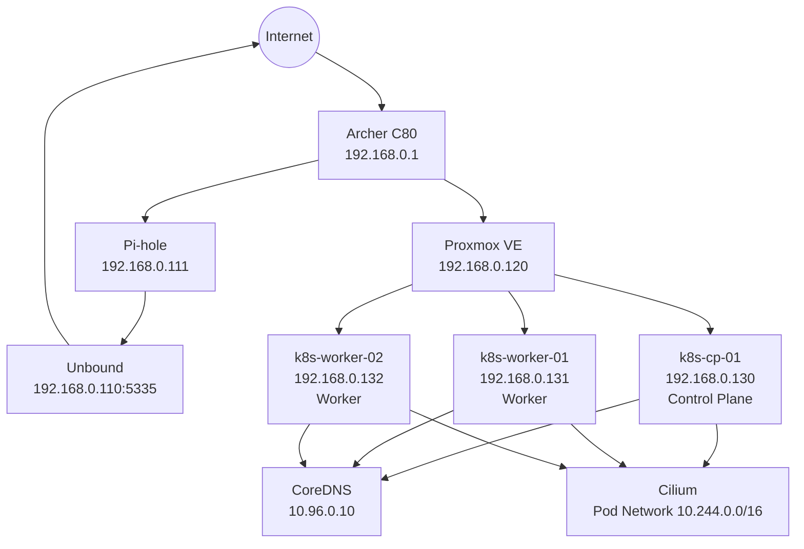
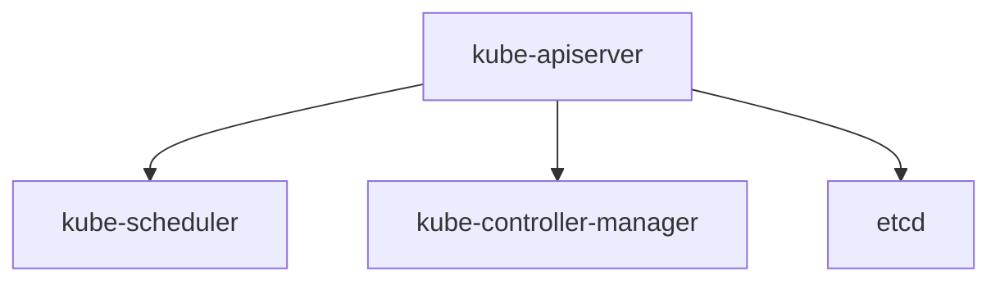
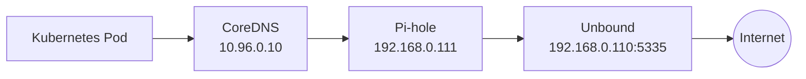
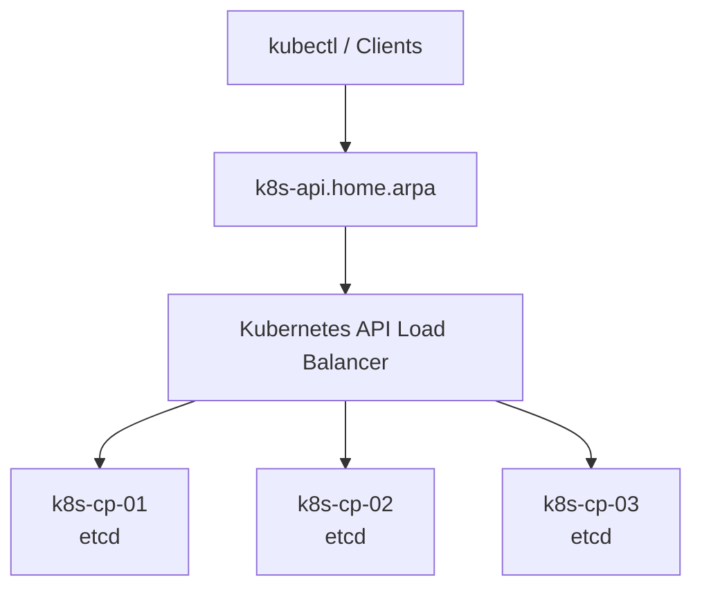

# Kubernetes Platform Architecture Diagrams

## 1. Physical and Logical Overview

```mermaid
flowchart TB
    Internet((Internet))

    Router["Archer C80<br/>192.168.0.1"]
    PiHole["Pi-hole<br/>192.168.0.111"]
    Unbound["Unbound<br/>192.168.0.110:5335"]
    Proxmox["Proxmox VE<br/>192.168.0.120"]

    CP["k8s-cp-01<br/>192.168.0.130<br/>Control Plane"]
    W1["k8s-worker-01<br/>192.168.0.131<br/>Worker"]
    W2["k8s-worker-02<br/>192.168.0.132<br/>Worker"]

    CoreDNS["CoreDNS<br/>10.96.0.10"]
    Cilium["Cilium<br/>Pod Network 10.244.0.0/16"]

    Internet --> Router
    Router --> PiHole
    PiHole --> Unbound
    Unbound --> Internet

    Router --> Proxmox
    Proxmox --> CP
    Proxmox --> W1
    Proxmox --> W2

    CP --> CoreDNS
    W1 --> CoreDNS
    W2 --> CoreDNS

    CP --> Cilium
    W1 --> Cilium
    W2 --> Cilium
```

## 2. Kubernetes Control Plane

```mermaid
flowchart TB
    API["kube-apiserver"]
    Scheduler["kube-scheduler"]
    Controller["kube-controller-manager"]
    ETCD["etcd"]

    API --> Scheduler
    API --> Controller
    API --> ETCD
```

## 3. DNS Flow

```mermaid
flowchart LR
    Pod["Kubernetes Pod"]
    CoreDNS["CoreDNS<br/>10.96.0.10"]
    PiHole["Pi-hole<br/>192.168.0.111"]
    Unbound["Unbound<br/>192.168.0.110:5335"]
    Internet((Internet))

    Pod --> CoreDNS
    CoreDNS --> PiHole
    PiHole --> Unbound
    Unbound --> Internet
```

## 4. Future HA

```mermaid
flowchart TB
    Client["kubectl / Clients"]
    DNS["k8s-api.home.arpa"]
    LB["Kubernetes API Load Balancer"]

    CP1["k8s-cp-01<br/>etcd"]
    CP2["k8s-cp-02<br/>etcd"]
    CP3["k8s-cp-03<br/>etcd"]

    Client --> DNS
    DNS --> LB
    LB --> CP1
    LB --> CP2
    LB --> CP3
```
